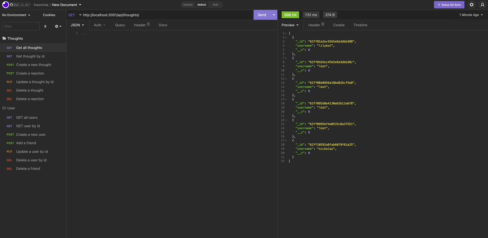

# Social Network API

## Project Description

This project entailed building an API for a social network web applications where users can share their thoughts, react to friends' thoughts, and create a friend list.

## Table of Contents

- [Languages and Technology Used](#languages-and-technology-used)
- [Project Demonstration](#project-demonstration)
- [Code Snippet](#code-snippet)
- [Author Links](#author-links)

## Languages and Technology Used

- JavaScript
- MongoDB
- Mongoose

## Project Demonstration

The following demonstration shows the ability to create a new user and how they are returned when you GET all users.



## Code Snippet

The code below displays a GET route to return a user by their id. If the user id doesn't exist, the message "No user could be found with that id" will be displayed.

```
getUserById(req, res) {
    User.findOne({ _id: req.params.id })
      .populate("thoughts")
      .then((user) =>
        !user
          ? res
              .status(404)
              .json({ message: "No user could be found with that id" })
          : res.json(user)
      )
      .catch((err) => res.status(500).json(err));
  },
```

## Author Links

- [GitHub](https://github.com/lilyannekot)
- [LinkedIn](https://www.linkedin.com/in/lilykot/)
